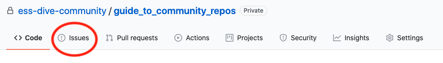

# Guide to starting an ESS-DIVE Community Repository

This is a meta-repository that will help users of the ESS-DIVE community repository become familiar with the typical workflows involved in starting and contributing to repositories on this page.

## Getting Started
- We can provide a table of contents
- With links to the other markdown documents contained in this repo
- We can also link to the gitbook when we have setup gitbook integration.

## The purpose of this repository

The purpose of this repository is to get you familiar with the process for starting and then managing a community repository.  The purpose of *your* repository can be up to you. You could be developing a data reporting standard for files that are eventually stored in the ESS-DIVE repository. You could be working on scripts that interact with our API. Whatever your project, this guide will show you how to set-up a community repository, the key ingredients to a repository (aka "repo"), and how to maintain the repo once you have uploaded the content to github.

First, 

## How to contribute

There are many ways to contribute to the ESS-DIVE community repository.  

####  Suggesting changes to an existing repository
If you would like to suggest changes to this, or any other repository on our community page, the best way to do so is by sumibmitting a github "issue "repository to you submit an issue by clicking the "issue" link toward the top of this repository's page.  We'll explain more about issues in a later chapter. You can also email us at ESS-DIVE support with questions related to this page or to anything else ESS-DIVE related.

## Copyright information  
We'll fill in copyright information here

## Funding and acknowledgements  
Type in funding info here

## Recommended citation  
We can eventually upload this repo as a data package to ESS-DIVE.
