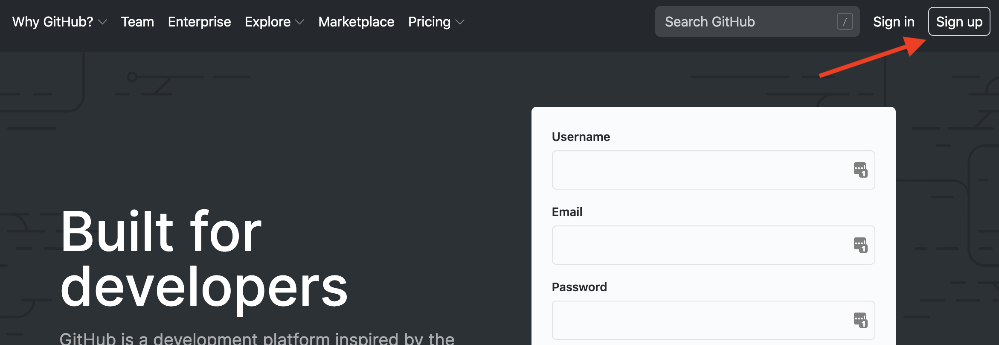
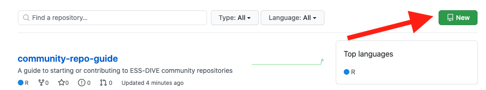
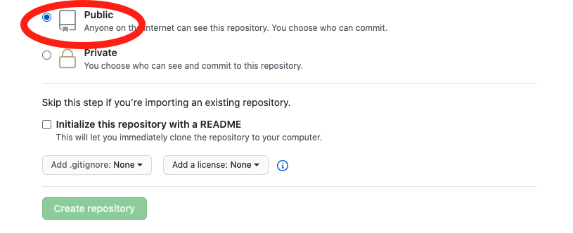
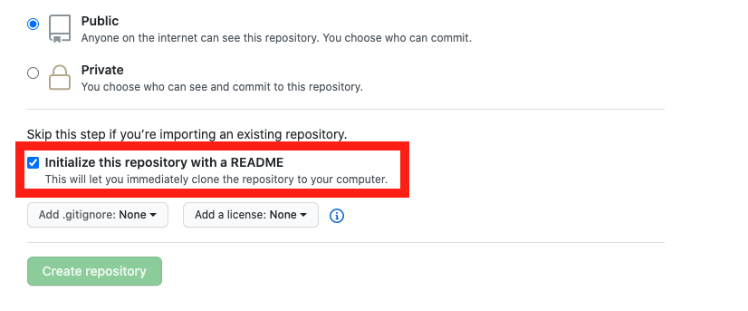

  

# Guide to the ESS-DIVE Community Repository

This is a meta-repository that will help users of the ESS-DIVE community GitHub space become familiar with the typical workflows involved in starting and contributing to repositories in this Community GitHub space.

## Table of contents
- [Purpose of the repository](#the-purpose-of-this-repository)
- [How to contribute](#how-to-contribute)
- Commenting on existing repositories
- Starting a new repository

## The purpose of this repository

The ESS-DIVE GitHub Community Space was started to provide a location where the ESS-DIVE user community can upload documents, codes, and tools related to the [ESS-DIVE repository](http://ess-dive.lbl.gov/). We designed this meta-repository so that ESS-DIVE contributors can familiarize themselves with the process of contributing to an existing ESS-DIVE related GitHub repository or establishing and maintaining a new GitHub repository.

## How to contribute
### Setting up a  GitHub account  
The first step for anyone interested in contributing to the ESS-DIVE GitHub community space is to go to the [GitHub website] and create a GitHub account or sign in if you already have an account. 

Then, login and navigate to our ESS-DIVE Community Space on GitHub https://github.com/ess-dive-community

##  Suggesting changes to an existing repository
If you would like to suggest changes to this, or any other repository in our community space, the best way to do so is by submitting a GitHub "issue". When someone submits an issue, the person or team managing the repository is notified, and then developers and the user community can collaborate on steps to solve the issue.   

To submit an issue, first make sure you are logged into your GitHub account. Then, navigate to the repository you would like to submit an issue to. Click the "issue" link toward the top of this repository's page (shown below). If you are having any difficulties accessing a repository or submitting an issue, you can email us at ESS-DIVE support with questions.

## Starting a new repository
We welcome new repositories from ESS-DIVE users that are creating software, documents, or tools related to the ESS-DIVE repository. Prior to creating a new repository, please email ESS-DIVE support to express your interest in contributing to the community space.

When you are ready to start a new repository on the ESS-DIVE Community Space click the green "New" button on the Community Space homepage.

On the next screen, you will be prompted to create a name for your repository. We encourage you to pick a repository name that is short and **uses dashes between words**. For example, the name of this repository is community-repo-guide.

Scrolling down the page, you can enter a description for your repository and then choose whether your repository is public or private. In the interest of creating open and freely available community resources, we ask that all repositories are publicly available. 

Your last step before creating your repository is to create a README file. By checking this option, a README.md file will automatically appear in your new repository. 

README files give the reader important context for your GitHub repository. For more information on the type of content you can provide in your README file, we have compiled a template README.md file which you can view [here](template_for_README.md).

## Copyright information  
Placeholder for copyright information about the Community Space

## Funding and acknowledgements  
Placeholder for ESS-DIVE funding information

## Recommended citation  
Placeholder for recommended citation once we upload this as a data package to the ESS-DIVE repository
